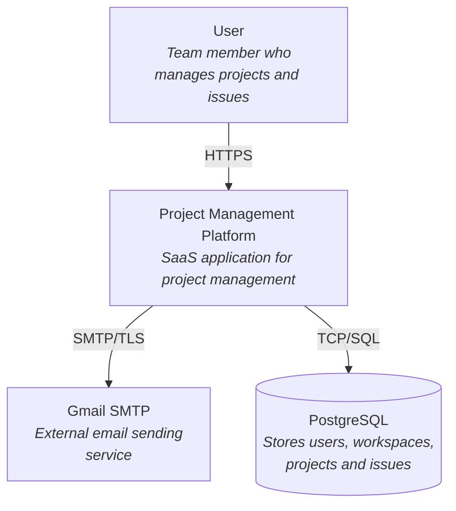
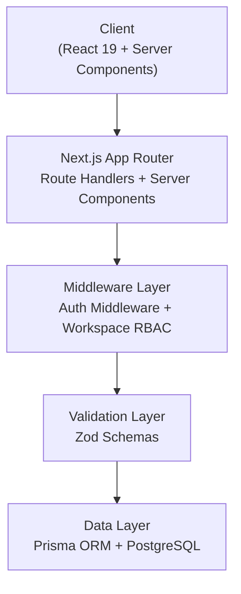
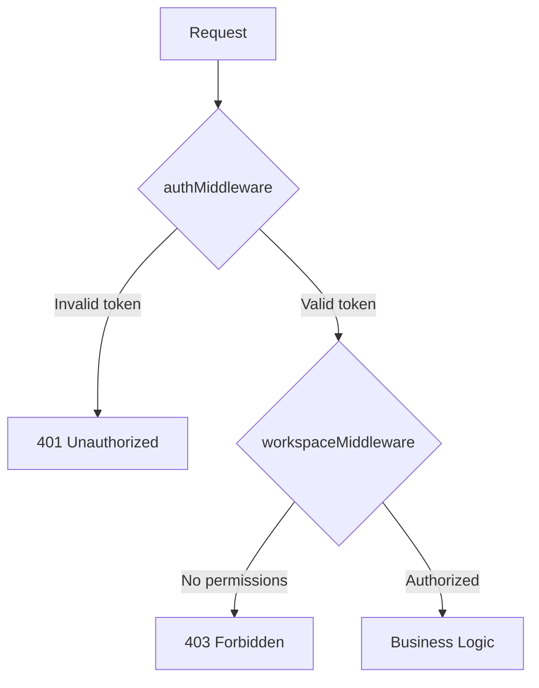
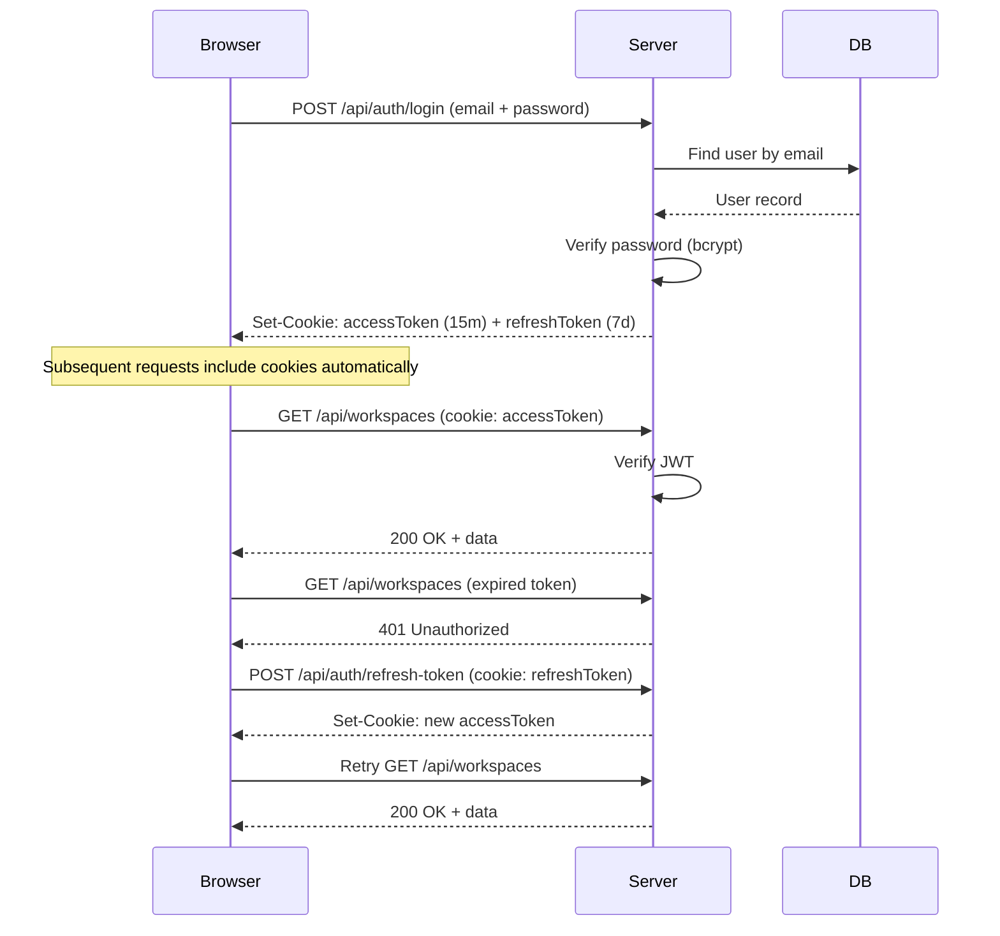
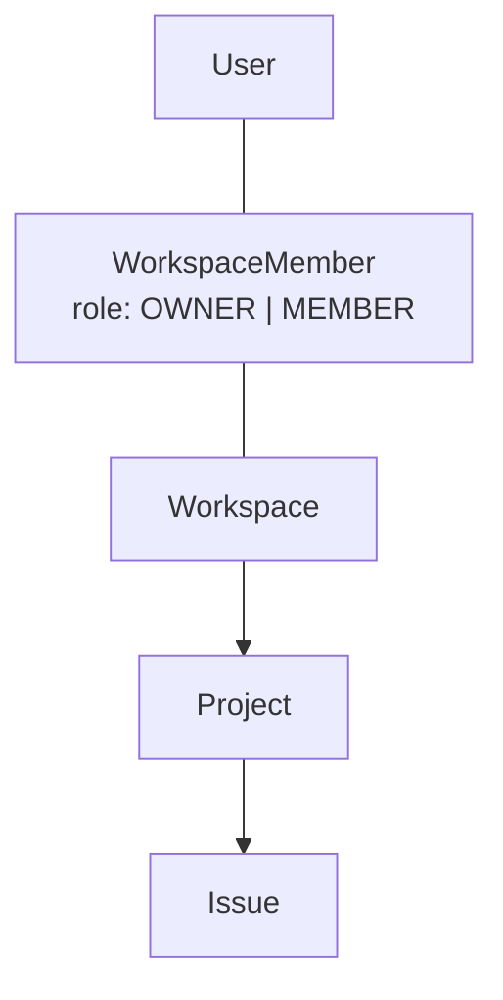
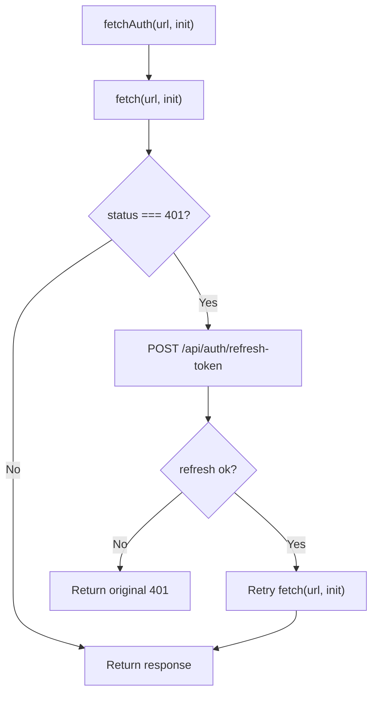
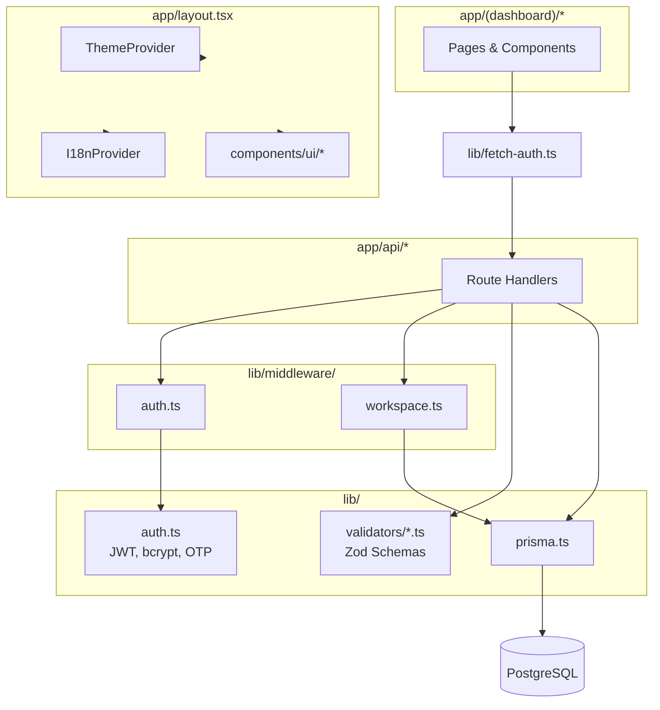

# System Architecture

## C4 - System Context (Level 0)



---

## Overview

SaaS project management application built with Next.js 16 (App Router), following a layered architecture with clear separation between presentation, business logic, and data access.



---

## Tech Stack

| Layer | Technology | Version |
|-------|-----------|---------|
| Framework | Next.js (App Router) | 16.2.x |
| Runtime | React (RSC + Client) | 19.2.x |
| Language | TypeScript | 5.x |
| ORM | Prisma | 7.8.x |
| Database | PostgreSQL | — |
| Authentication | JWT + bcryptjs + otplib | — |
| Validation | Zod | 4.x |
| UI | shadcn/ui + Radix UI + Tailwind CSS 4 | — |
| Forms | React Hook Form | 7.x |
| i18n | i18next + react-i18next | — |
| Email | Nodemailer (Gmail SMTP) | 8.x |
| Themes | next-themes | 0.4.x |
| Testing | Vitest + @vitest/coverage-v8 | 4.x |

---

## Layer Structure

### 1. Presentation (`app/`)

Uses the Next.js App Router with route groups to separate contexts:

```
app/
├── (auth)/          → Public pages (login, register, forgot-password)
├── (dashboard)/     → Protected pages (workspaces, projects, issues)
├── api/             → Route Handlers (REST API)
├── layout.tsx       → Root layout (providers: Theme, i18n, Toaster)
└── page.tsx         → Landing page
```

**Decisions:**
- Route groups `(auth)` and `(dashboard)` allow independent layouts without affecting the URL.
- Server Components by default; Client Components only where interactivity is needed.
- Providers (Theme, i18n) wrap the app from the root layout.

### 2. API Layer (`app/api/`)

REST API implemented with Next.js Route Handlers:

```
api/
├── auth/
│   ├── register/            POST    → Create account
│   ├── login/               POST    → Authenticate + issue tokens
│   ├── logout/              POST    → Invalidate refresh token
│   ├── refresh-token/       POST    → Rotate access token
│   ├── request-password-reset/  POST → Send reset email
│   ├── reset-password/      POST    → Confirm reset with token
│   └── otp/                 POST    → Enable 2FA
│                            PATCH   → Verify OTP code
├── workspaces/
│   ├── route.ts             GET     → List user's workspaces
│   │                        POST    → Create workspace
│   └── [id]/
│       ├── route.ts         GET     → Workspace details
│       │                    PATCH   → Edit workspace
│       ├── members/         GET     → List members
│       │                    POST    → Invite member
│       │                    DELETE  → Remove member
│       └── projects/        GET     → List projects
│                            POST    → Create project
├── projects/
│   └── [id]/
│       ├── route.ts         GET     → Project details
│       │                    PATCH   → Edit project
│       ├── archive/         PATCH   → Archive/unarchive
│       └── issues/          GET     → List issues (with filters)
│                            POST    → Create issue
└── issues/
    └── [id]/
        └── route.ts         GET     → Details + history
                             PATCH   → Edit (records history)
                             DELETE  → Delete
```

**Route Handler Pattern:**
1. Execute `authMiddleware()` → get authenticated user
2. Validate permissions if applicable
3. Parse and validate body with Zod schema
4. Execute operation in Prisma
5. Return JSON response

### 3. Middleware (`lib/middleware/`)

Application-level middleware (not Next.js Edge middleware):

| File | Responsibility |
|------|---------------|
| `auth.ts` | Extracts token from `Authorization` header or `accessToken` cookie, verifies JWT, queries user in DB |
| `workspace.ts` | Verifies user membership and role in a specific workspace |

**Authentication Flow in Route Handlers:**



### 4. Validation (`lib/validators/`)

Zod schemas organized by domain:

| File | Schemas |
|------|---------|
| `auth.ts` | register, login, forgot-password, reset-password, otp |
| `workspace.ts` | create, update, invite-member |
| `project.ts` | create, update |
| `issue.ts` | create, update, filters |

### 5. Data Access (`lib/prisma.ts` + `prisma/`)

- Singleton Prisma client with PostgreSQL adapter (`@prisma/adapter-pg`).
- Migrations managed with `prisma migrate dev`.
- Schema defined in `prisma/schema.prisma`.

---

## Authentication and Security

### Token Flow



| Aspect | Implementation |
|--------|---------------|
| Access Token | JWT signed with `JWT_ACCESS_SECRET`, configurable expiration (default 15m) |
| Refresh Token | JWT signed with `JWT_REFRESH_SECRET`, configurable expiration (default 7d) |
| Storage | httpOnly cookies (not accessible from client-side JS) |
| Automatic refresh | `fetchAuth()` wrapper retries with refresh on 401 |
| Password hashing | bcrypt with cost factor 12 |
| Timing attacks | Compares against `DUMMY_PASSWORD_HASH` when user doesn't exist |
| 2FA | TOTP via otplib (compatible with Google Authenticator) |
| Password reset | Unique token with expiration stored in DB |

### Route Protection

- **API Routes**: Protected by `authMiddleware()` which validates the JWT on each request.
- **Dashboard Pages**: The `(dashboard)` layout verifies the session; if there's no valid token, redirects to `/login`.
- **Auth Pages**: If the user is already authenticated, redirects to the home page.

---

## Authorization (RBAC)

Role-based system per workspace:



| Action | OWNER | MEMBER |
|--------|-------|--------|
| Create project | ✅ | ✅ |
| Edit project | ✅ | ✅ |
| Archive project | ✅ | ✅ |
| Create issue | ✅ | ✅ |
| Edit issue | ✅ | ✅ |
| Invite member | ✅ | ❌ |
| Remove member | ✅ | ❌ |
| Edit workspace | ✅ | ❌ |

---

## Internationalization (i18n)

Dual client/server architecture:

| Context | File | Mechanism |
|---------|------|-----------|
| Client Components | `lib/i18n.ts` | i18next + react-i18next + HTTP backend |
| Server Components / API | `lib/i18n-server.ts` | Direct reading of JSON files from `public/locales/` |

```
public/locales/
├── es/
│   └── {namespace}.json
└── en/
    └── {namespace}.json
```

Current namespaces: `auth`, `workspace`, `project`, `issue`.

Languages configurable via environment variables:
- `NEXT_PUBLIC_DEFAULT_LOCALE` → default language
- `NEXT_PUBLIC_SUPPORTED_LOCALES` → supported languages (comma-separated)

---

## Frontend

### Providers (Root Layout)

```tsx
<html>
  <body>
    <I18nProvider>
      <ThemeProvider>
        {children}
        <Toaster />
      </ThemeProvider>
    </I18nProvider>
  </body>
</html>
```

### UI Components

- **Base**: shadcn/ui (Radix UI primitives + Tailwind CSS)
- **Icons**: Lucide React
- **Notifications**: Sonner (toast)
- **Forms**: React Hook Form + @hookform/resolvers (Zod)
- **Themes**: next-themes (dark/light mode with toggle)

### Fetch Pattern (Client)



---

## Testing

| Type | Tool | Location |
|------|------|----------|
| Integration | Vitest | `tests/integration/` |
| Coverage | @vitest/coverage-v8 | — |

Integration tests exercise the Route Handlers directly, simulating complete HTTP requests against the API.

---

## Module Dependency Diagram



---

## Environment Variables

| Variable | Required | Description |
|----------|----------|-------------|
| `JWT_ACCESS_SECRET` | ✅ | Secret for signing access tokens |
| `JWT_REFRESH_SECRET` | ✅ | Secret for signing refresh tokens |
| `JWT_ACCESS_EXPIRES_IN` | ❌ | Access token expiration (default: `15m`) |
| `JWT_REFRESH_EXPIRES_IN` | ❌ | Refresh token expiration (default: `7d`) |
| `DATABASE_URL` | ✅ | PostgreSQL connection string |
| `GMAIL_USER` | ✅ | Gmail account for sending emails |
| `GMAIL_PASS` | ✅ | Gmail app password |
| `NEXT_PUBLIC_DEFAULT_LOCALE` | ❌ | Default language (default: `es`) |
| `NEXT_PUBLIC_SUPPORTED_LOCALES` | ❌ | Supported languages (default: `es,en`) |

---

## Technical Decisions

| Decision | Justification |
|----------|---------------|
| App Router over Pages Router | Native support for RSC, nested layouts, route groups |
| JWT in httpOnly cookies | Prevents XSS; client cannot read/modify tokens |
| Refresh token rotation | Limits attack window if a token is compromised |
| bcrypt cost 12 | Balance between security and performance (~250ms per hash) |
| Dummy hash comparison | Prevents timing attacks that reveal user existence |
| Prisma over raw SQL | Type-safety, automatic migrations, developer experience |
| Zod over class-validator | Native TypeScript integration, composable, tree-shakeable |
| shadcn/ui over component library | Components copied into the project, full control, no lock-in |
| Vitest over Jest | Faster, native ESM, compatible with the Vite ecosystem |
| Dual i18n (client/server) | RSC cannot use hooks; server reads files directly |
