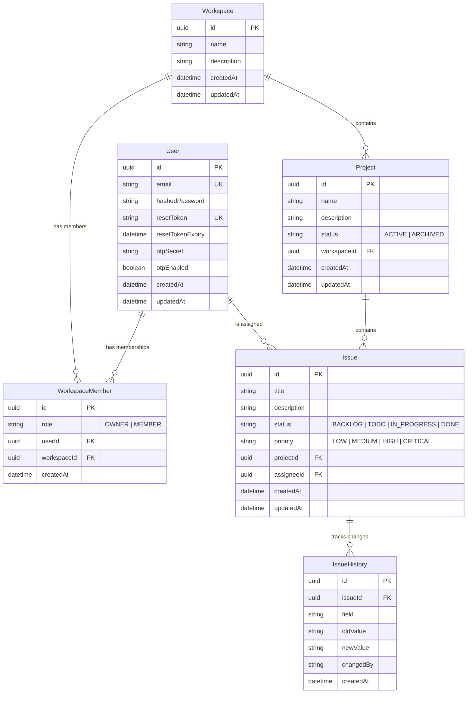

# Entity Relationship Diagram

## Diagram

---

## Entities

### User

Represents a registered user on the platform. Manages authentication, 2FA, and password recovery.

| Field | Type | Nullable | Default | Description |
|-------|------|----------|---------|-------------|
| id | UUID | No | `uuid()` | Unique identifier |
| email | String | No | — | User email (unique, used as login) |
| hashedPassword | String | No | — | Password hashed with bcrypt (cost factor 12) |
| resetToken | String | Yes | — | Temporary token for password recovery |
| resetTokenExpiry | DateTime | Yes | — | Reset token expiration date |
| otpSecret | String | Yes | — | TOTP secret for 2FA (generated with otplib) |
| otpEnabled | Boolean | No | `false` | Indicates whether the user has 2FA enabled |
| createdAt | DateTime | No | `now()` | Registration date |
| updatedAt | DateTime | No | auto | Last record update |

### Workspace

Collaborative workspace. Groups projects and members under the same organizational context.

| Field | Type | Nullable | Default | Description |
|-------|------|----------|---------|-------------|
| id | UUID | No | `uuid()` | Unique identifier |
| name | String | No | — | Workspace name |
| description | String | Yes | — | Optional description |
| createdAt | DateTime | No | `now()` | Creation date |
| updatedAt | DateTime | No | auto | Last update |

### WorkspaceMember

Join table that relates users to workspaces and defines their role within it.

| Field | Type | Nullable | Default | Description |
|-------|------|----------|---------|-------------|
| id | UUID | No | `uuid()` | Unique identifier |
| role | String | No | `"MEMBER"` | User role: `OWNER` or `MEMBER` |
| userId | UUID | No | — | FK → User.id |
| workspaceId | UUID | No | — | FK → Workspace.id |
| createdAt | DateTime | No | `now()` | Date the user joined the workspace |

### Project

Project within a workspace. Contains issues and can be active or archived.

| Field | Type | Nullable | Default | Description |
|-------|------|----------|---------|-------------|
| id | UUID | No | `uuid()` | Unique identifier |
| name | String | No | — | Project name |
| description | String | Yes | — | Optional description |
| status | String | No | `"ACTIVE"` | Status: `ACTIVE` or `ARCHIVED` |
| workspaceId | UUID | No | — | FK → Workspace.id |
| createdAt | DateTime | No | `now()` | Creation date |
| updatedAt | DateTime | No | auto | Last update |

### Issue

Unit of work within a project. Represents a task, bug, or user story.

| Field | Type | Nullable | Default | Description |
|-------|------|----------|---------|-------------|
| id | UUID | No | `uuid()` | Unique identifier |
| title | String | No | — | Descriptive issue title |
| description | String | Yes | — | Detailed description (supports long text) |
| status | String | No | `"BACKLOG"` | Status: `BACKLOG`, `TODO`, `IN_PROGRESS`, `DONE` |
| priority | String | No | `"MEDIUM"` | Priority: `LOW`, `MEDIUM`, `HIGH`, `CRITICAL` |
| projectId | UUID | No | — | FK → Project.id |
| assigneeId | UUID | Yes | — | FK → User.id (assigned responsible) |
| createdAt | DateTime | No | `now()` | Creation date |
| updatedAt | DateTime | No | auto | Last update |

### IssueHistory

Audit log that captures each change made to an issue. Allows reconstructing the complete timeline of modifications.

| Field | Type | Nullable | Default | Description |
|-------|------|----------|---------|-------------|
| id | UUID | No | `uuid()` | Unique identifier |
| issueId | UUID | No | — | FK → Issue.id |
| field | String | No | — | Name of the modified field (e.g., `status`, `priority`, `assigneeId`) |
| oldValue | String | Yes | — | Previous value (null on creation) |
| newValue | String | Yes | — | New value (null if the value is removed) |
| changedBy | String | No | — | ID of the user who made the change |
| createdAt | DateTime | No | `now()` | Change timestamp |

---

## Relationships

| Source | Target | Cardinality | FK | On Delete | Description |
|--------|--------|-------------|-----|-----------|-------------|
| User | WorkspaceMember | 1:N | `WorkspaceMember.userId` | — | A user can belong to multiple workspaces |
| Workspace | WorkspaceMember | 1:N | `WorkspaceMember.workspaceId` | Cascade | Deleting a workspace removes all memberships |
| Workspace | Project | 1:N | `Project.workspaceId` | Cascade | Deleting a workspace removes all its projects |
| Project | Issue | 1:N | `Issue.projectId` | Cascade | Deleting a project removes all its issues |
| User | Issue | 1:N | `Issue.assigneeId` | SetNull | Deleting a user leaves their issues unassigned |
| Issue | IssueHistory | 1:N | `IssueHistory.issueId` | Cascade | Deleting an issue removes all its history |

---

## Constraints and Indexes

| Table | Type | Fields | Description |
|-------|------|--------|-------------|
| User | Unique | `email` | No two users can have the same email |
| User | Unique | `resetToken` | Ensures uniqueness of the recovery token |
| WorkspaceMember | Unique Compound | `(userId, workspaceId)` | A user can only have one membership per workspace |

---

## Enums (valid values)

### WorkspaceMember.role
| Value | Description |
|-------|-------------|
| `OWNER` | Workspace creator. Can invite/remove members and edit configuration |
| `MEMBER` | Regular member. Can create projects and issues |

### Project.status
| Value | Description |
|-------|-------------|
| `ACTIVE` | Active project, visible in the main listing |
| `ARCHIVED` | Archived project, hidden from the main listing but still accessible |

### Issue.status
| Value | Description | Kanban Order |
|-------|-------------|--------------|
| `BACKLOG` | Pending planning | Column 1 |
| `TODO` | Planned, ready to start | Column 2 |
| `IN_PROGRESS` | In active development | Column 3 |
| `DONE` | Completed | Column 4 |

### Issue.priority
| Value | Description |
|-------|-------------|
| `LOW` | Low priority, can wait |
| `MEDIUM` | Normal priority |
| `HIGH` | High priority, address soon |
| `CRITICAL` | Urgent, requires immediate attention |
